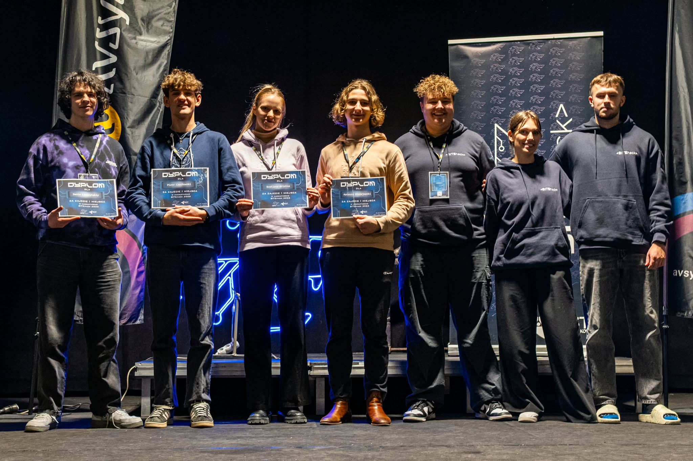
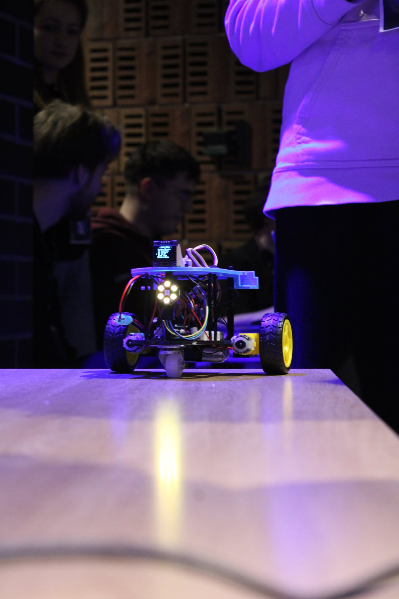
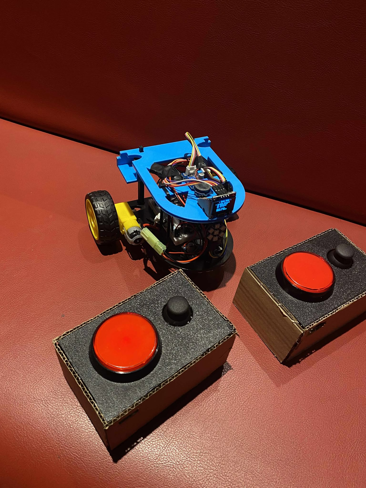

# Bitehack2026

# 🏆 Bitehack 2026 Winner: Interactive Gaming Robot

Welcome to the official repository for the winning robot from Bitehack 2026! This project is a fully interactive, mobile gaming platform designed to bring people together through collaborative driving and arcade-style mini-games. 

**Built fully during 24h hackathon**

---

## Key Features

### Hardware & Controls

* **Dual Remote Controllers:** The platform includes two dedicated remote controllers, allowing for seamless multiplayer engagement right out of the box.
* **Integrated Display:** A built-in small screen serves as the main hub for UI navigation and playing the onboard mini-games.

### Dynamic Driving Modes

* **Normal Mode:** A traditional setup where a single user takes full control of the robot's movement and navigation.
* **Co-op Mode:** A unique collaborative driving experience where both players must coordinate their inputs to pilot the robot, testing teamwork and communication.

### Mini-Games Library

The robot doubles as a mobile arcade terminal! The current roster of games includes:

* **Reaction Time Measurement:** A competitive mode to test and record which player has the fastest reflexes.
* **Falling Blocks Catcher:** Fast-paced arcade action where players must click the button in exact time to catch falling blocks.
* **Memory Game:** Players have to remember a sequence shonw on screen and replicate it with the joystick.
* **Rhythm Clicker** Players first listen to the rythm played by the robot and then try to replicate it using the button on their joysticks.
* *...and plenty more!*

---

## Media Overview

*Check out our team and the robot in action through the links below:*

* **Performance Video:** [Watch the robot in action](https://docs.google.com/videos/d/1NO5ToAMwWUb_9_9sNm4uw9kwfd2ElCXrSwYZ840qI2E/edit?usp=drive_link)

* **Gallery:**

